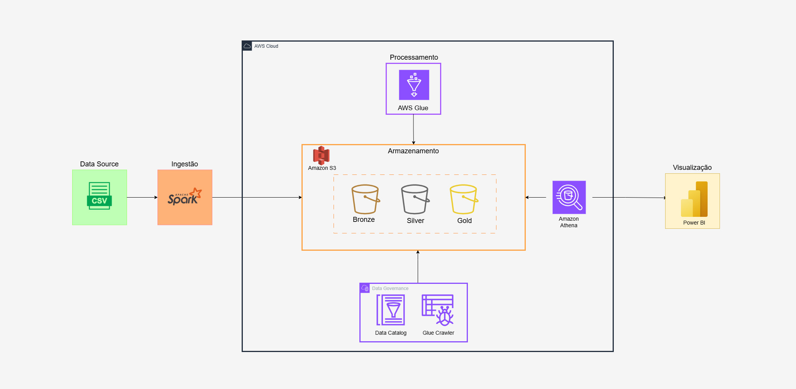

# 🚀 Olist Data Engineering Project  

  

## 📋 Sobre o Projeto  

Este projeto de engenharia de dados foi desenvolvido com o objetivo de criar uma pipeline completa para ingestão, processamento e análise de dados utilizando o **dataset da Olist**, uma das maiores plataformas de e-commerce do Brasil.  

Nesse projeto, foi aplicada a **Arquitetura Medalhão** para organizar os dados em três camadas: Bronze, Silver e Gold. O projeto foi finalizado com a criação de **dashboards no Power BI** para visualizar insights estratégicos, como categorias de produtos mais vendidas e desempenho por região.  

---

## 🛠 Tecnologias Utilizadas  

As principais ferramentas e tecnologias utilizadas no projeto incluem:  

- **AWS S3**: Para armazenamento dos dados em camadas organizadas.  
- **AWS Glue**: Ingestão, transformação e catalogação dos dados.  
- **Glue Crawler e Glue Data Catalog**: Descoberta e organização dos metadados.  
- **Amazon Athena**: Consultas SQL diretamente nos dados no S3.  
- **Apache Spark**: Para carregamento e ingestão dos dados brutos.  
- **Power BI**: Para criação de dashboards interativos e análise visual dos dados.  

---

## 🏗 Arquitetura do Projeto  

O projeto segue a **Arquitetura Medalhão**, estruturada em três camadas:  

1. **Bronze**:  
   - Contém os dados brutos, diretamente extraídos da fonte (arquivo CSV).  
   - Dados armazenados sem modificações para preservar sua integridade original.  

2. **Silver**:  
   - Dados processados e limpos.  
   - Aplicação de transformações e remoção de inconsistências para preparar os dados para análises.  

3. **Gold**:  
   - Dados enriquecidos e agregados.  
   - Otimizados para análises específicas e geração de dashboards.  

---

## 📊 Fluxo do Projeto  

1. **Ingestão de Dados**:  
   - O arquivo CSV foi carregado no S3 utilizando **Spark** e armazenado na camada Bronze.  

2. **Processamento**:  
   - **AWS Glue** foi utilizado para transformar os dados da camada Bronze em Silver e, posteriormente, em Gold.  
   - As transformações incluíram limpeza, normalização e enriquecimento dos dados.  

3. **Catalogação de Metadados**:  
   - **Glue Crawler** foi configurado para detectar esquemas e organizar os metadados no **Glue Data Catalog**.  

4. **Consultas SQL**:  
   - Foi utilizado o **Amazon Athena** para consultas nos dados armazenados no S3.  

5. **Visualização**:  
   - No **Power BI**, foi criado dashboards para gerar insights estratégicos, como:  
     - **Categorias de Produtos Mais Vendidas**  
     - **Desempenho de Vendas por Região**  
     - **Pontualidade nas Entregas**  
     - **Métodos de Pagamento Preferidos pelos Clientes**  

---

## 🔍 Principais Insights  

Os dashboards revelaram informações estratégicas, como:  

- As categorias de produtos mais populares entre os clientes.  
- O desempenho de vendas em diferentes regiões do Brasil.  
- A eficiência nas entregas em relação ao prazo prometido.  
- Preferências dos clientes em métodos de pagamento.  

Esses insights podem apoiar decisões de negócio e estratégias comerciais.  

---

## 📂 Dataset  

O dataset utilizado neste projeto é público e foi extraído da plataforma Kaggle. Ele contém informações sobre:  
- Pedidos realizados.  
- Produtos vendidos.  
- Avaliações dos clientes.  
- Métodos de pagamento.  
- Prazos e status de entrega.  

---

## 📬 Contato  

Se tiver dúvidas ou sugestões, entre em contato comigo pelo [LinkedIn](https://www.linkedin.com/in/seu-usuario) ou deixe um comentário aqui no repositório.  
